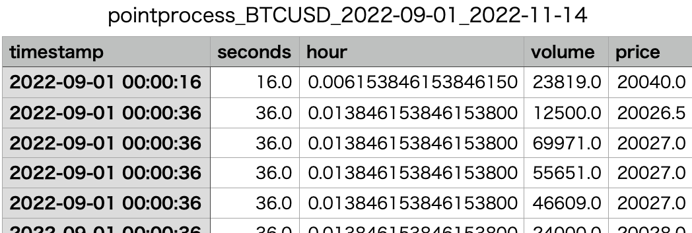

# ディレクトリ構成

```
pointprocess_crypto
  |-checkpoints
  |-dataframes
  |-images
  |-result
  |-utils
  |  |-datasets.py
  |  |-losses.py
  |-models.py
  |-plot_train_history.py
  |-stochastic_declustering.py
  |-test_pointmodels.py
  |-train.py
```

# checkpoints

checkpointsフォルダには，確率的デクラスタリングにおける$g,\mu,P$や，PointFormer，PointRNN，PointLSTMの学習済みパラメータが保存されている．実験結果は，[こちら](https://drive.google.com/drive/folders/1TaEJFAmxQYpf3wJpL0rhBCEmTB-gw0LN?usp=share_link)からダウンロードできる．

# dataframes

dataframesフォルダには，utils/datasets.pyを実行することによって得られる，bybitからダウンロード・加工した約定データや点過程データが保存されている．実験で使用したファイルは[こちら](https://drive.google.com/drive/folders/1IuvWkJlHV-DXOtxZYxp2uFZX7XVsUkQD?usp=share_link)からダウンロードできる．

# images

学習中の損失関数の推移のプロットやモデルの推論結果のプロットなどの画像が保存されている．overall_architecture.pdfをはじめ，論文に掲載した図も保存されている．imagesフォルダの中身は[こちら](https://drive.google.com/drive/folders/14WkUfFCoGn1lYxJVtgo9_5mV9uMtTM5r?usp=share_link)からダウンロードできる．

# result

学習済みモデルの，テストデータにおける損失などが保存されている．実験結果は[こちら](https://drive.google.com/drive/folders/1HUS4jLz-7bKBEKdcf_f4m9CmeSeEvrP_?usp=share_link)からダウンロードできる．

# utils/datasets.py

暗号資産取引所bybitから指定した期間の約定データをダウンロードし，点過程データに加工してcsvファイルをdataframesフォルダに保存する．

## 引数

- start_dates：開始日時．複数指定可能．
- end_dates：終了日時．複数指定可能．
- symbols：通貨ペア．複数指定可能．
- v_name：約定データのうち，出来高を表す列名．デフォルトは"size"．
- v_threshold：点過程データにするために約定データを抽出する際，閾値とする出来高．

## 実行例

```
python utils/datasets.py --start_dates 2022/9/1 2022/11/15 2022/12/1 2022/12/8 2022/12/15 --end_dates 2022/11/14 2022/11/30 2022/12/7 2022/12/14 2022/12/21 --symbols BTCUSD ETHUSD XRPUSD --v_name size --v_thresholds 10000 10000 10000
```

[2022/9/1, 2022/11/14]，[2022/11/15, 2022/11/30]，[2022/12/1, 2022/12/7]，[2022/12/8, 2022/12/14]，[2022/12/15, 2022/12/21]の期間の，[BTCUSD，ETHUSD，XRPUSD]の約定データをダウンロードし，dataframesフォルダに保存する．例えば，dataframes/pointprocess_BTCUSD_2022-09-01_2022-11-14.csvは，次のようなデータフレームである．



# stochastic_declustering.py

式(7)で表される自己励起点過程のノンパラメトリック推定を行う．bybitから指定した期間の点過程データを取得し，推定された$\mu,g$とL2誤差の履歴$P$をcheckpoints/mu.npy，checkpoints/g.npy，checkpoints/P.npyとして保存し，$\mu,g,\lambda$のグラフと$P$のグラフをimages/mug_estimate.pdf，images/p_err.pdfとして保存する．

## 引数

- start_date：開始日時
- end_dates：終了日時
- symbols：通貨ペア
- v_name：約定データのうち，出来高を表す列名．デフォルトは"size"．
- v_threshold：点過程データにするために約定データを抽出する際，閾値とする出来高．

## 実行例

```
python stochastic_declustering.py --start_date 2022/3/1 --end_date 2022/3/3 --symbol BTCUSD --v_name size --v_threshold 150000
```

# train.py

models.pyで定義されているモデル (PointRNN，PointLSTM，PointFormer) の訓練を行う．dataframesフォルダ配下のcsvファイル名を指定することでデータセットを作成し，訓練済みモデルのパラメータをcheckpointsフォルダに保存する．

## 引数

- model：モデルの名前．"PointRNN","PointLSTM","PointFormer"のいずれかを指定する．
- point_num：入力約定数$N$．デフォルトは60．
- future_seconds：予測時点秒数$T$．デフォルトは60．
- load_name：checkpointsフォルダ内の，学習途中のモデルパラメータファイルの名前．追加学習する際に指定する．デフォルトはNone．
- best_save_name：checkpointsフォルダに保存する，最も損失の低いモデルパラメータファイルの名前．
- last_save_name：checkpointsフォルダに保存する，最後のイテレーションのモデルパラメータファイルの名前．
- learning_rate：学習率．デフォルトは0.001．
- window_size：損失関数WindowLossのウインドウサイズ．デフォルトは10．
- batch_size：バッチサイズ．デフォルトは256．
- num_epoch：エポック数．デフォルトは100．
- num_workers：ワーカー数．デフォルトは2．
- start_dates：学習データセットを作るために使用する，dataframesフォルダ内の点過程データの開始日時．
- end_dates：学習データセットを作るために使用する，dataframesフォルダ内の点過程データの終了日時．
- symbols：学習データセットを作るために使用する，dataframesフォルダ内の点過程データの通貨ペア．

## 実行例

```
python train.py --model PointFormer --load_name pointformer_last.tar --best_save_name pointformer_best.tar --last_save_name pointformer_last.tar --start_dates 2022/9/1 2022/11/15 - -end_dates 2022/11/14 2022/11/30 --symbols BTCUSD ETHUSD XRPUSD
```

# plot_train_history.py

複数のモデルの，学習時のlossの推移をプロットし，imagesフォルダに保存する．

## 引数

- load_names：checkpointsフォルダ内の，学習済みモデルパラメータファイル．
- model_names：モデルの名前．load_namesの数と同一である必要がある．
- save_img_name：imagesフォルダに保存するグラフの名前．デフォルトは"losses_plot.pdf"．

## 実行例

```
python plot_train_history.py --load_names pointformer_last.tar pointrnn_last.tar pointlstm_last.tar --model_names pointformer pointrnn pointlstm
```

# test_pointmodels.py

学習したモデルに対し，テストデータセットのWindowLossで評価し，一定期間の点過程データでの推論結果をプロットする．

## 引数

- model：モデルの名前．"PointRNN","PointLSTM","PointFormer"のいずれかを指定する．
- point_num：入力約定数$N$．デフォルトは60．
- future_seconds：予測時点秒数$T$．デフォルトは60．
- load_name：checkpointsフォルダ内の，学習済みモデルパラメータファイルの名前．
- window_size：損失関数WindowLossのウインドウサイズ．デフォルトは10．
- batch_size：バッチサイズ．デフォルトは256．
- num_workers：ワーカー数．デフォルトは2．
- start_dates：テストデータセットを作るために使用する，dataframesフォルダ内の点過程データの開始日時．
- end_dates：テストデータセットを作るために使用する，dataframesフォルダ内の点過程データの終了日時．
- symbols：テストデータセットを作るために使用する，dataframesフォルダ内の点過程データの通貨ペア．
- total_loss_save_name：テストデータセット全体における損失をresultフォルダ配下に保存する名前．
- loss_list_save_name：テストデータの予測期間を三分割，例えば$T=60$なら期間[0,60]を[0,20],[21,40],[41,60]の三つに分割してそれぞれの損失をresultフォルダ配下に保存する名前．
- start_datetime：テストデータの中で，実際に推論結果をプロットするために使用する開始時点．start_datetimeから1日後までの期間が使用される．
- sub_start_datetime：start_datetimeから一日後までの期間のうち，さらに短い期間をプロットするための開始時点．
- sub_end_datetime：start_datetimeから一日後までの期間のうち，さらに短い期間をプロットするための終了時点．
- pred_times_name：推論結果のプロットをimagesフォルダ配下に保存するためのファイル名．

## 実行例

```
python test_pointmodels.py --model PointFormer --load_name pointformer_best.tar --start_dates 2022/12/1 --end_dates 2022/12/7 --symbols BTCUSD ETHUSD XRPUSD --total_loss_save_name pointformer_total_loss --loss_list_save_name pointformer_loss_list --start_datetime 2022/12/2/00:00:00 --sub_start_datetime 2022/12/2/13:00:00 --sub_end_datetime 2022/12/2/15:00:00 --pred_times_name pointformer_pred_times.pdf
```

上を実行することで，checkpointsフォルダ配下に保存されたpointformer_best.tarという学習済みパラメータファイルを用いてテストが実行される．result/pointformer_total_lossというファイルが作成され，中にテストデータセットにおけるWindowLossの値が記される．

```
0.0229532294452046
```

